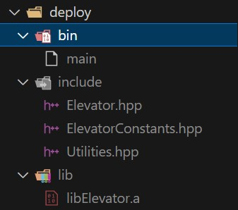

# tmp-elevator
This project represents a possible implementation of an elevator. To provide 
details on personal interactions with various languages the initial solution 
is a prototype in python under `./prototypes` and the core implementation 
is with C++17.

## Assumptions
There are several assumptions associated with the project which are in two 
categories:

- System: machine capabilities and user permissions
- Elevator: features restrictions

### System Specific
The user has `sudo` access for installations on `Linux`/`x86_64` 

**Note** these requirements could be resovled by developing/deploying within 
containers.

### Elevator Specific
The elevator project implementation itself has some built-in assumptions as well:

- Floor travel time is fixed at 10 seconds
- 2 arguments are expected for the executable
- Required inputs for the executable are:

| name | type | example |
| --- | --- | --- |
| starting floor | int | 4 |
| floors to traverse | string | 1,2,6,15,77 |

- Only valid floors to traverse are provided as inputs
- Floors traversed will be in the order that they were received (e.g. FIFO)
- An elevator will not move if it has not received an input command
- Floor travel time also includes floor settling time
- No elevator capacity, fire safety, or building security settings are considered
- No elevator button input commands are considered (e.g. stream of input commands)
- No total travel time optimization has been implemented

## Getting Started
To get started making changes and building/deploying this project locally follow the steps in this section.

### Prerequisites
Although possible to build os/arch agnostic or with a containerized development
and deployment environment it will be assumed here that `Linux x86_64` is used.
Below are the required commands to install pre-reqs (e.g. `Ubuntu 22.04`).

```bash
sudo apt-get install build-essential cmake g++ Python3.10
sudo apt-get install gdb
sudo apt-get install cppcheck valgrind
pip3 install conan
pip3 show conan
conan profile detect
```

### Verifying Installation Requirements
Below are commands to sanity check installations occurred as expected.

```bash
g++ --version
cppcheck --version
valgrind --version
python3 --version
gdb --version
conan --version
```

One can make changes in the future to their conan profile here 
`~/.conan2/profiles/default`. See below for default example in this project.

```ini
[settings]
arch=x86_64
build_type=Release
compiler=gcc
compiler.cppstd=gnu17
compiler.libcxx=libstdc++11
compiler.version=11
os=Linux
```

### Static Analysis
To run static analysis on this project execute the following:

```bash
cd ~/{project-root}/src
cppcheck --enable=all --inconclusive --std=c++17 \
--output-file=./reports/cppcheck_report.txt .
```

Validate in this projects reports directory that `cppcheck_report.txt` is empty.

### Dynamic Analysis
To run dynamic analysis on this project execute the following:

```bash
cd ~/{project-root}/deploy
valgrind --leak-check=full --show-leak-kinds=all \
         --track-origins=yes --log-file=../reports/valgrind_report.txt \
         ./bin/main -s "1" -t "1,2,3,4,12,19,1" -l "trace" -f "logfile.txt"
```

On completion a report like below should be produced in this projects 
`reports` directory (see below for example output).

```log
==20033== Memcheck, a memory error detector
==20033== Copyright (C) 2002-2017, and GNU GPL'd, by Julian Seward et al.
==20033== Using Valgrind-3.18.1 and LibVEX; rerun with -h for copyright info
==20033== Command: ./bin/main -s 1 -t 1,2,3,4,12,19,1 -l trace -f logfile.txt
==20033== Parent PID: 468
==20033== 
==20033== 
==20033== HEAP SUMMARY:
==20033==     in use at exit: 0 bytes in 0 blocks
==20033==   total heap usage: 4,016 allocs, 4,016 frees, 149,791 bytes allocated
==20033== 
==20033== All heap blocks were freed -- no leaks are possible
==20033== 
==20033== For lists of detected and suppressed errors, rerun with: -s
==20033== ERROR SUMMARY: 0 errors from 0 contexts (suppressed: 0 from 0)
```

### Build
Now, to build the project execute the following commands from the project's 
root directory (e.g. `~/{project-root}`).

```bash
conan create . -o with_tests=True --build=missing
```

Then verify that the local conan cache has the package.

```bash
conan list
```

```log
Found <n> pkg/version recipes matching * in local cache
Local Cache
...
  elevator
    elevator/${VERSION}
```

### Install
Once verified install the package locally to execute.

```bash
cd ~/{package-root}/deploy 
rm -r ./*
conan install --requires elevator/${VERSION} \
      --deployer-package elevator/${VERSION} --build=missing
```

The deployment should look similar to the image below (`with_tests=False`)



### Run
From the `deploy` directory execute the program with the following command. 
Positional arguments are:

  - `--staring_floor` (`-s`)
  - `--floors` (`-t`)

```bash
./bin/main -s "1" -t "1,2,3,4,12,19,1"
[2025-07-20 12:24:52.568] [info] > Logging initialized with level: info
[2025-07-20 12:24:52.568] [info] > Elevator config:
[2025-07-20 12:24:52.568] [info]        > Starting floor: 1
[2025-07-20 12:24:52.568] [info]        > Floors to traverse: 1,2,3,4,12,19,1
[2025-07-20 12:24:52.568] [info] > Elevator constructor called.
[2025-07-20 12:24:52.568] [info]        > (Total travel time: 350, Floors traversed: 1, 1, 2, 3, 4, 12, 19, 1)
[2025-07-20 12:24:52.568] [info] > Elevator destructor called.
```

## Not Implemented
Below are features that may add value to the project over time:

### Deployments
- Runner access/instantiation
- Token/secret management (e.g. docker/gitlab/conan registry)
- `gitlab-ci.yml` (e.g. conan/docker deployment)
- Docker development environment

### Documentation
- `gitlab pages` (user guide documentation)
- `gcovr` test report generation 
- Doxygen comments are added, but not generated as a document
- OS/ARCH agnostic deployment (e.g. os/arch conan profiles)

### Elevator 
- Elevator stream of inputs (from floors and buttons)
    - See `~/{project-root}/prototypes/elevator-prototype.ipynb` 
      for more details
- Elevator configuration file
    - How many floors?
    - Security settings (do any floors require certain access codes/card entry?)
    - Fire safety settings (what happens when the elevator stops between floors?)
    - Weight capacity
    - Elevator size
- Should the order of floor visits ever be optimized?
- Should the elevator ever have a default resting floor?
- Elevator interface/execution improvements 
    - Main controller?
    - How does the main controller receive/respond to button inputs on each 
      floor and within the elevator itself?
    - What sensors are available in the elevator?
    - Should the program wait the travel time?
    - Should there be a visual representation of the elevator?